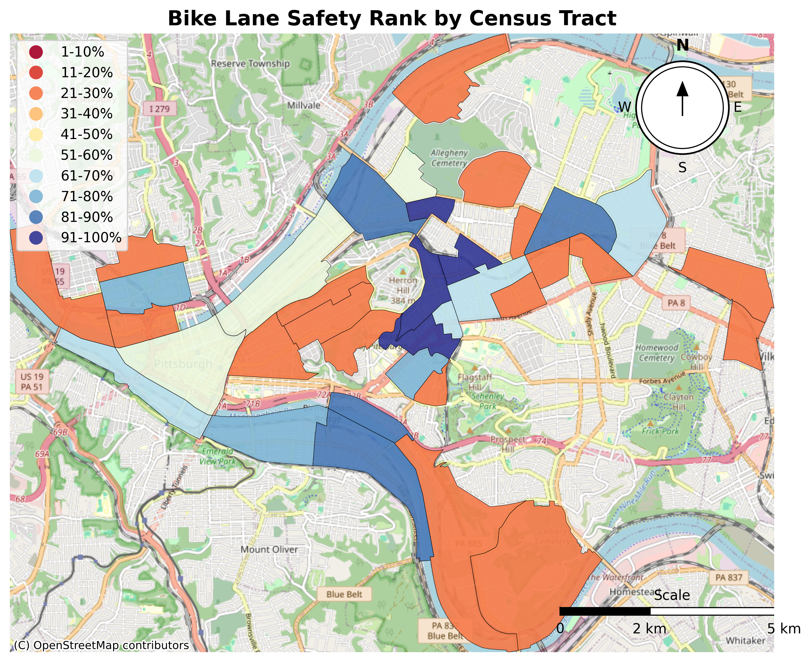
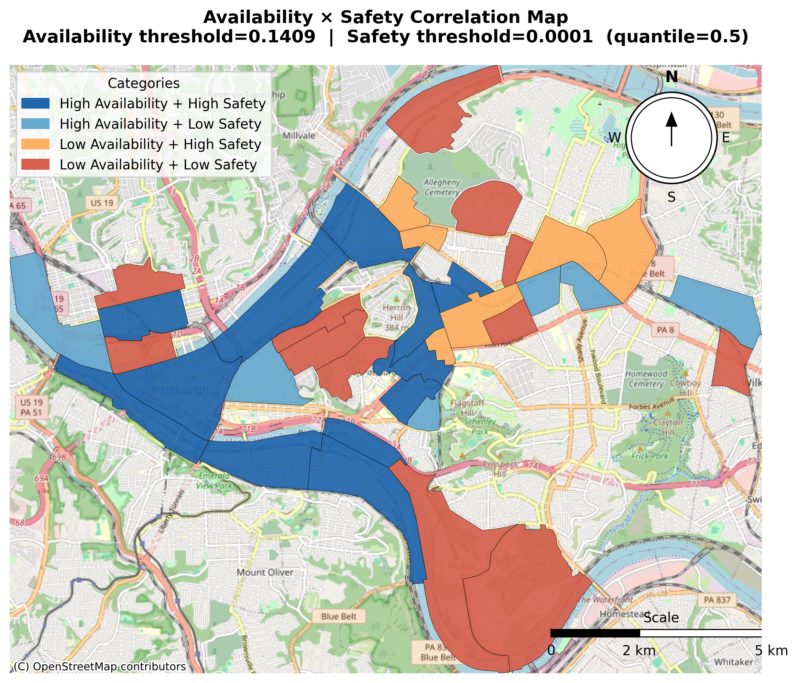
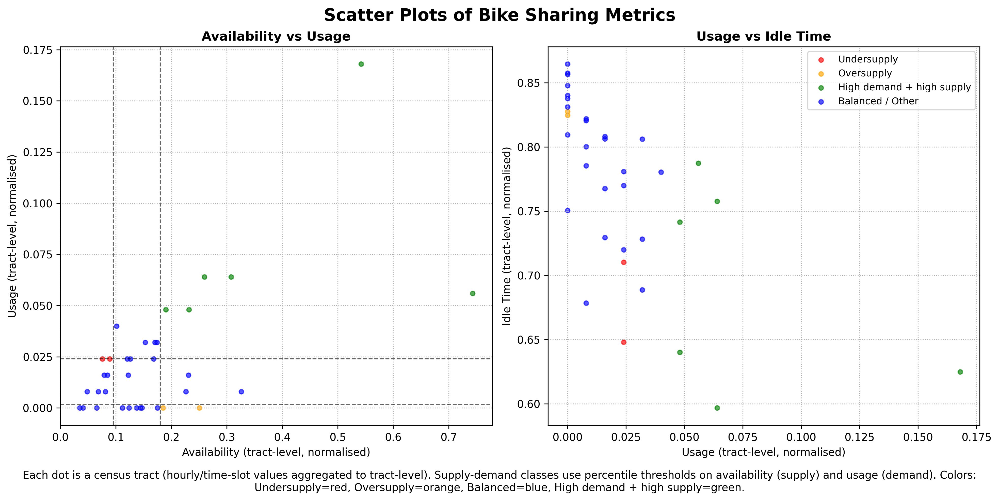

# Mobility Package

### A Python Package for Multidimensional Fairness Analysis of Shared Micromobility Systems


---

## Overview

This package provides a structured Python implementation for computing, analyzing, and visualizing fairness metrics in shared micromobility systems (SMS). It was developed as the computational backbone of the research paper:

> **Evaluating Multidimensional Fairness in Shared Micromobility: Case Studies of Docked and Dockless Systems**
> *Tara Zibandehkhooy, Violet (Xinying) Chen*
> Preprint submitted to Journal of Transport Geography, September 2025

The framework operationalizes a pipeline that moves from raw GBFS (General Bikeshare Feed Specification) snapshots through utility computation, fairness measurement, and spatial visualization. It supports both docked systems (e.g. Citi Bike NYC) and dockless systems (e.g. Lime, Bird, Spin in San Francisco and Seattle), and is designed to be extensible to other cities and system types.

The package distinguishes between **static decision outcomes** — capacity and safety — which reflect long-term operator and policymaker decisions, and **dynamic system outcomes** — availability, usage, and idle time — which emerge from real-time user behavior. Fairness is evaluated across both dimensions using established inequality metrics (Gini coefficient) and combined fairness-efficiency metrics (Alpha fairness at α = 1).

---

## Sample Outputs

All visualizations below were produced by running the package on one day of Pittsburgh Healthy Ride docked bike-share data.

**Bike Lane Safety Rank by Census Tract**
Choropleth map showing the distribution of bike lane safety scores across Pittsburgh census tracts, binned into deciles using the RdYlBu colormap.



---

**Availability × Safety Correlation Map**
Four-quadrant correlation map comparing vehicle availability and bike lane safety per census tract. Each tract is classified as High/High, High/Low, Low/High, or Low/Low relative to the median threshold.



---

**Supply vs Demand Scatter Plot**
Two-panel scatter plot classifying every census tract by its availability (supply) and usage (demand). Undersupplied tracts (low availability, high demand) are shown in red.



---

## Pipeline Architecture

```
Raw GBFS Snapshot (.txt)
         |
         v
+------------------------------------------+
|  docked_wrapper                          |
|  for docked systems                      |
|  (NYC, NJ, Pittsburgh)                   |
|                                          |
|  dockless_wrapper                        |
|  for dockless systems                    |
|  (SF Lime/Spin, Seattle Bird/Lime)       |
+------------------------------------------+
         |
         |  Produces per-tract CSVs:
         |  availability, capacity,
         |  usage, idle_time, safety
         v
+------------------------------------------+
|  fairness_calculation                    |
|  Gini coefficient + Alpha fairness       |
+------------------------------------------+
         |
         v
+------------------------------------------+
|  Visualization Modules                   |
|                                          |
|  map_visual       Utility choropleth maps|
|  capacity_map_visual  Capacity decile    |
|  correlation_visual   4-quadrant maps    |
|  scatter_visual   Supply-demand scatter  |
|  trend_visual     Weekly time-series     |
|  table_visual     Fairness summary table |
+------------------------------------------+
```

---

## Supported Systems

| City          | Operator     | System Type | `system_key` / `city` argument      |
|---------------|--------------|-------------|--------------------------------------|
| New York City | Citi Bike    | Docked      | `city="NYC"`                         |
| New Jersey    | Citi Bike    | Docked      | `city="NJ"`                          |
| Pittsburgh    | Healthy Ride | Docked      | `city="PITT"`                        |
| San Francisco | Lime         | Dockless    | `system_key="SF_LIME_DOCKLESS"`      |
| San Francisco | Spin         | Dockless    | `system_key="SF_SPIN_DOCKLESS"`      |
| Seattle       | Bird         | Dockless    | `system_key="SEATTLE_BIRD_DOCKLESS"` |
| Seattle       | Lime         | Dockless    | `system_key="SEATTLE_LIME_DOCKLESS"` |

---

## Package Structure

```
mobility_package/
│
├── __init__.py                  Package entry point — imports all modules
│
├── docked_wrapper.py            Utility computation for docked systems
├── dockless_wrapper.py          Utility computation for dockless systems
├── fairness_calculation.py      Gini and Alpha fairness computation
│
├── map_visual.py                Utility choropleth maps
├── capacity_map_visual.py       Capacity decile choropleth maps
├── correlation_visual.py        Two-metric correlation quadrant maps
├── scatter_visual.py            Supply-demand classification scatter plots
├── trend_visual.py              Weekly fairness time-series visualization
└── table_visual.py              Paper-style fairness summary table

assets/
├── NYC/                         Spatial assets for New York City
├── NJ/                          Spatial assets for New Jersey
├── PITT/                        Spatial assets for Pittsburgh
├── SF/                          Spatial assets for San Francisco
└── SEATTLE/                     Spatial assets for Seattle

example_notebooks/
├── example_run_pitt_docked.ipynb      Full pipeline — Pittsburgh (docked)
└── example_run_seattle_dockless.ipynb Full pipeline — Seattle Bird (dockless)

docs/
└── images/                      Sample output images
```

---

## Assets Folder

All spatial assets required by the package — census block shapefiles, census tract shapefiles, street centerlines, and bike lane files — are pre-configured and stored in the `assets/` folder. The package resolves all asset paths automatically using the city or system key you pass. **You never need to specify shapefile paths manually.**

The `assets/` folder is organized by city and must sit in the **same directory** as `mobility_package/`:

```
your_project/
├── mobility_package/       ← the package code
├── assets/                 ← all spatial assets, pre-configured
│     ├── NYC/
│     │     ├── tl_2024_36_tabblock20.shp   (+ .dbf .prj .shx)
│     │     ├── tl_2024_36_tract.shp        (+ .dbf .prj .shx)
│     │     ├── centroid_tract_nyc.csv
│     │     ├── CSCL_PlowNYC_20250619.csv
│     │     └── New_York_City_Bike_Routes_20250619.csv
│     ├── NJ/
│     │     ├── tl_2024_34_tabblock20.shp   (+ .dbf .prj .shx)
│     │     ├── tl_2024_34_tract.shp        (+ .dbf .prj .shx)
│     │     ├── centroid_tract_nj.csv
│     │     ├── Tran_road.shp               (+ .dbf .prj .shx)
│     │     └── bike-lanes-2020-division-of-transportation.shp
│     ├── PITT/
│     │     ├── tl_2024_42_tabblock20.shp   (+ .dbf .prj .shx)
│     │     ├── tl_2024_42_tract.shp        (+ .dbf .prj .shx)
│     │     ├── centroid_tract_pa.csv
│     │     ├── Pittsburgh_Street_Centerline.shp
│     │     └── Bike_Lanes.shp              (+ .dbf .prj .shx)
│     ├── SF/
│     │     ├── tl_2024_06_tabblock20.shp   (+ .dbf .prj .shx)
│     │     ├── tl_2024_06_tract.shp        (+ .dbf .prj .shx)
│     │     ├── centroid_tract_ca.csv
│     │     ├── Centerline.csv
│     │     └── Bikelane.csv
│     └── SEATTLE/
│           ├── tl_2024_53_tabblock20.shp   (+ .dbf .prj .shx)
│           ├── tl_2024_53_tract.shp        (+ .dbf .prj .shx)
│           ├── Seattle_Streets.shp         (+ .dbf .prj .shx)
│           ├── SDOT_Bike_Facilities_5512142703833213564.geojson
│           └── Planned_Bike_Facilities.shp (+ .dbf .prj .shx)
└── example_notebooks/
```

When you clone or download the repository, the `assets/` folder is included at the correct location. No path configuration is needed on any machine.

---

## Example Notebooks and Data

Two fully worked example notebooks are included — one for a docked system (Pittsburgh) and one for a dockless system (Seattle Bird). Each runs the complete pipeline end to end: data loading → metric computation → fairness calculation → all visualizations.

### Pittsburgh — Docked System

**Notebook:** `example_notebooks/example_run_pitt_docked.ipynb`

**Example GBFS dataset:** [Download from Google Drive](https://drive.google.com/drive/folders/1DdybTTZJmnQ6n1rI1R65yhCoGpYTqFh8?usp=drive_link)

The dataset contains one day of Pittsburgh Healthy Ride GBFS data (June 9, 2025) including station status snapshots, station information, and trip records. All spatial assets are already in `assets/PITT/` — you only need to download the GBFS data files.

After downloading, place the data files in a `PITT_ASSETS/` folder next to the notebook:

```
example_run_pitt_docked.ipynb
PITT_ASSETS/
  pitt_docked_station_status_6_9.txt
  pitt_station_information_06_09.csv
  pitt_tripdata_june_2025.csv
```

Update Cell 1 with the correct filenames and date window. Everything else runs automatically.

### Seattle Bird — Dockless System

**Notebook:** `example_notebooks/example_run_seattle_dockless.ipynb`

**Example GBFS dataset:** [Download from Google Drive](https://drive.google.com/drive/folders/1oitn7K7Hje81o7qr2VgxwHCjwdOhAFPF?usp=drive_link)

The dataset contains one day of Seattle Bird dockless GBFS snapshot data. All spatial assets are already in `assets/SEATTLE/` — you only need to download the snapshot file.

After downloading, place the file in a `SEATTLE_BIRD_ASSETS/` folder next to the notebook:

```
example_run_seattle_dockless.ipynb
SEATTLE_BIRD_ASSETS/
  seattle_bird_freebike_status.txt
```

Update Cell 1 with the correct filename and date window. Everything else runs automatically.

### Note on Trend Plots

The fairness trend visualization (`trend_visual`) is the only step in both notebooks that requires more than one day of data. A single day produces a flat line — this is expected. To produce meaningful trend plots, collect 7 consecutive days of daily CSVs into a folder and pass the folder path. Both notebooks include a `TREND_MODE` flag to switch between single-day and weekly mode without changing anything else.

---

## Installation

```bash
git clone https://github.com/your-username/mobility-package.git
cd mobility-package
pip install -r requirements.txt
```

**`requirements.txt`**

```
pandas>=2.0
numpy>=1.24
geopandas>=0.14
shapely>=2.0
contextily>=1.4
matplotlib>=3.8
requests>=2.31
tqdm>=4.66
```

---

## Quick Start

All spatial assets are pre-configured. You only need to supply your GBFS data files.

```python
from mobility_package import (
    docked_wrapper, fairness_calculation, map_visual, table_visual,
)

# Step 1 — Load context (spatial assets resolved automatically)
ctx = docked_wrapper.load_docked_context(
    city                    = "NYC",
    station_status_txt      = r"path/to/nyc_station_status.txt",
    station_information_csv = r"path/to/nyc_station_information.csv",
    output_dir              = "NYC_OUTPUT",
)

# Step 2 — Compute all utility metrics
results = docked_wrapper.compute_all(
    ctx,
    trip_csv   = r"path/to/citibike_tripdata/",
    time_start = "2025-04-06 00:00:00",
    time_end   = "2025-04-06 23:59:59",
)

# Step 3 — Compute fairness
fairness_calculation.run_paper_style_fairness(
    city_key         = "NYC_DOCKED",
    save_directory   = "NYC_OUTPUT/FAIRNESS",
    availability_csv = "NYC_OUTPUT/availability__norm__tract.csv",
    usage_csv        = "NYC_OUTPUT/usage_norm_hourly_tract.csv",
    idle_time_csv    = "NYC_OUTPUT/idle_time_norm_tract.csv",
    capacity_csv     = "NYC_OUTPUT/capacity_tract_with_vehicle_and_docks_norm.csv",
    safety_csv       = "NYC_OUTPUT/safety_bike_lane_norm_tract.csv",
    filter_to_capacity_service_area = True,
)

# Step 4 — Visualize (tract shapefile is already in assets/NYC/)
map_visual.plot_all(
    availability_csv = "NYC_OUTPUT/availability__norm__tract.csv",
    usage_csv        = "NYC_OUTPUT/usage_norm_hourly_tract.csv",
    idle_time_csv    = "NYC_OUTPUT/idle_time_norm_tract.csv",
    safety_csv       = "NYC_OUTPUT/safety_bike_lane_norm_tract.csv",
    capacity_csv     = "NYC_OUTPUT/capacity_tract_norm.csv",
    tract_shp        = "assets/NYC/tl_2024_36_tract.shp",
    output_dir       = "NYC_OUTPUT/MAPS",
)

# Step 5 — Fairness summary table (renders inline in Jupyter)
table_visual.make_table(
    csv_path = "NYC_OUTPUT/FAIRNESS/NYC_DOCKED_fairness_results.csv"
)
```

---

## Module Reference

### 1. `docked_wrapper`

**Supported cities:** NYC, NJ, Pittsburgh

**Metrics produced:**

| Metric       | Output CSV |
|--------------|------------|
| Availability | `availability__norm__tract.csv` |
| Capacity     | `capacity_tract_norm.csv`, `capacity_tract_with_vehicle_and_docks_norm.csv` |
| Usage        | `usage_norm_hourly_tract.csv` |
| Idle Time    | `idle_time_norm_tract.csv` |
| Safety       | `safety_bike_lane_norm_tract.csv` |

```python
ctx = docked_wrapper.load_docked_context(
    city                    = "PITT",
    station_status_txt      = r"path/to/station_status.txt",
    station_information_csv = r"path/to/station_information.csv",
    output_dir              = "PITT_OUTPUT",
    remove_tz_suffix        = " EDT",
)

results = docked_wrapper.compute_all(ctx, trip_csv=..., time_start=..., time_end=...)

# Or individually
avail  = docked_wrapper.compute_availability(ctx, time_start=..., time_end=...)
cap    = docked_wrapper.compute_capacity(ctx,     time_start=..., time_end=...)
safety = docked_wrapper.compute_safety(ctx,       time_start=..., time_end=...)
usage  = docked_wrapper.compute_usage(ctx,        trip_csv=..., time_start=..., time_end=...)
idle   = docked_wrapper.compute_idle_time(ctx,    trip_csv=..., time_start=..., time_end=...)
```

**Finding your timestamp suffix:**
```python
import json
with open("your_station_status.txt") as f:
    line = json.loads(f.readline())
    print(list(line.keys())[0])  # e.g. "2025-04-06 14:32:00 EDT" → remove_tz_suffix=" EDT"
```

---

### 2. `dockless_wrapper`

**Supported systems:** SF Lime, SF Spin, Seattle Bird, Seattle Lime

**Metrics produced:**

| Metric       | Output CSV |
|--------------|------------|
| Availability | `availability_norm_hourly_tract_*.csv` |
| Capacity     | `capacity_tract_*.csv` |
| Usage        | `usage_norm_hourly_tract_*.csv` |
| Idle Time    | `idle_norm_hourly_tract_*.csv` |
| Safety       | `safety_tract_*.csv` |

```python
ctx = dockless_wrapper.load_dockless_context(
    system_key          = "SEATTLE_BIRD_DOCKLESS",
    freebike_status_txt = r"path/to/seattle_bird_status.txt",
    output_dir          = "SEATTLE_BIRD_OUTPUT",
    time_start          = "2025-06-15 00:00:00",
    time_end            = "2025-06-15 23:59:59",
)

results = dockless_wrapper.compute_all(ctx)  # no trip CSV needed
```

---

### 3. `fairness_calculation`

```python
fairness_calculation.run_paper_style_fairness(
    city_key         = "PITT_DOCKED",
    save_directory   = "PITT_OUTPUT/FAIRNESS",
    capacity_csv     = "PITT_OUTPUT/capacity_tract_with_vehicle_and_docks_norm.csv",
    availability_csv = "PITT_OUTPUT/availability__norm__tract.csv",
    safety_csv       = "PITT_OUTPUT/safety_bike_lane_norm_tract.csv",
    usage_csv        = "PITT_OUTPUT/usage_norm_hourly_tract.csv",
    idle_time_csv    = "PITT_OUTPUT/idle_time_norm_tract.csv",
    filter_to_capacity_service_area = True,   # False for dockless
)
```

---

### 4. `map_visual`

```python
map_visual.plot_all(
    availability_csv = "OUTPUT/availability__norm__tract.csv",
    usage_csv        = "OUTPUT/usage_norm_hourly_tract.csv",
    idle_time_csv    = "OUTPUT/idle_time_norm_tract.csv",
    safety_csv       = "OUTPUT/safety_bike_lane_norm_tract.csv",
    capacity_csv     = "OUTPUT/capacity_tract_norm.csv",
    tract_shp        = "assets/PITT/tl_2024_42_tract.shp",
    output_dir       = "OUTPUT/MAPS",
)
```

---

### 5. `capacity_map_visual`

```python
capacity_map_visual.plot_capacity(
    capacity_csv      = "OUTPUT/capacity_tract_with_vehicle_and_docks_norm.csv",
    tract_shp         = "assets/PITT/tl_2024_42_tract.shp",
    output_dir        = "OUTPUT/CAPACITY_MAPS",
    min_stations      = 1,
    drop_zeros        = True,
)
```

---

### 6. `correlation_visual`

```python
correlation_visual.plot_correlation(
    metric_x     = "availability",
    csv_x        = "OUTPUT/availability__norm__tract.csv",
    metric_y     = "usage",
    csv_y        = "OUTPUT/usage_norm_hourly_tract.csv",
    capacity_csv = "OUTPUT/capacity_tract_norm.csv",
    tract_shp    = "assets/PITT/tl_2024_42_tract.shp",
    output_dir   = "OUTPUT/CORRELATION_MAPS",
)
```

**Available metrics:** `"availability"`, `"usage"`, `"idle_time"`, `"safety"`

---

### 7. `scatter_visual`

```python
master, class_df, fig = scatter_visual.plot_scatter(
    availability_csv          = "OUTPUT/availability__norm__tract.csv",
    usage_csv                 = "OUTPUT/usage_norm_hourly_tract.csv",
    idle_csv                  = "OUTPUT/idle_time_norm_tract.csv",
    output_dir                = "OUTPUT/SCATTER",
    threshold_method          = "percent",
    use_symmetric_percentiles = True,
    availability_low_pct      = 30,
    usage_high_pct            = 70,
)
```

---

### 8. `trend_visual`

```python
trend_visual.plot_all(
    city_key           = "PITT_DOCKED",
    output_dir         = "OUTPUT/TREND",
    capacity_input     = "OUTPUT/capacity_tract_with_vehicle_and_docks_norm.csv",
    availability_input = "OUTPUT/WEEKLY/availability",  # folder of 7 daily CSVs
    usage_input        = "OUTPUT/WEEKLY/usage",
    idle_time_input    = "OUTPUT/WEEKLY/idle_time",
    filter_to_capacity_service_area = True,
    band_alpha                      = 0.20,
)
```

---

### 9. `table_visual`

```python
# Renders inline in Jupyter
table_visual.make_table(
    csv_path    = "OUTPUT/FAIRNESS/PITT_DOCKED_fairness_results.csv",
    decimals    = 3,
    font_family = "Times New Roman",
    render      = "styler",
)
```

---

## Adding a New City or System

### New Docked City

Add an entry to `CITY_CONFIG` in `docked_wrapper.py` and place asset files in `assets/<CITY_KEY>/`:

```python
CITY_CONFIG["CHICAGO"] = {
    "use_api_fallback": True,
    "assets": {
        "census_blocks": _asset("CHICAGO", "tl_2024_17_tabblock20.shp"),
        "tracts":        _asset("CHICAGO", "tl_2024_17_tract.shp"),
        "centroid_csv":  _asset("CHICAGO", "centroid_tract_il.csv"),
        "centerline":    _asset("CHICAGO", "chicago_street_centerline.shp"),
        "bike_lanes":    _asset("CHICAGO", "chicago_bike_routes.shp"),
    },
    "geo": {
        "blocks_id":             "GEOID20",
        "tract_id":              "GEOID",
        "crs":                   "EPSG:4326",
        "metric_crs":            "EPSG:32616",   # UTM Zone 16N — find yours at epsg.io
        "safety_type":           "shp",           # "shp" or "csv_wkt"
        "wkt_candidates":        (),
        "external_tract_prefix": None,
        "drop_staten_island":    False,
    },
    "safety_rule": {
        "col_candidates": ("facility", "type", "class", "lane_type"),
        "match_type":     "contains",             # "contains" | "equals" | "not_empty_or_contains"
        "match_value":    "PROTECT",
    },
}
```

Then call it normally: `docked_wrapper.load_docked_context(city="CHICAGO", ...)`

### New Dockless System

Add an entry to `_SYSTEMS` in `dockless_wrapper.py` and place asset files in `assets/<CITY_FOLDER>/`:

```python
_SYSTEMS["AUSTIN_LIME_DOCKLESS"] = {
    "city":                "Austin",
    "vendor":              "Lime",
    "tag":                 "austin_lime",
    "default_output_dir":  "AUSTIN_LIME_DOCKLESS_FULL_RUN",
    "raw_csv":             "austin_lime_status_raw.csv",
    "done_csv":            "austin_lime_status_done.csv",
    "assets": {
        "census_blocks_shp":       _asset("AUSTIN", "tl_2024_48_tabblock20.shp"),
        "centerline_streets_path": _asset("AUSTIN", "austin_street_centerline.shp"),
        "bike_lanes_path":         _asset("AUSTIN", "austin_bike_lanes.shp"),
        "centroid_tract_path":     _asset("AUSTIN", "tl_2024_48_tract.shp"),
    },
    "safety_epsg": 32614,   # UTM Zone 14N — find yours at epsg.io
}
```

Then call it normally: `dockless_wrapper.load_dockless_context(system_key="AUSTIN_LIME_DOCKLESS", ...)`

**Key decisions when configuring a new city:**

- `metric_crs` / `safety_epsg` — projected CRS for street length measurement. Find your city's UTM zone at [epsg.io](https://epsg.io).
- `safety_type` — `"shp"` for shapefiles, `"csv_wkt"` for CSVs with a WKT geometry column.
- `safety_rule` — inspect your bike lanes attribute table to find which column and value identifies protected lanes.
- Census shapefiles — download from [US Census TIGER/Line](https://www.census.gov/cgi-bin/geo/shapefiles/index.php). Select "Census Blocks" or "Census Tracts" and choose your state by FIPS code.

| State | FIPS | Shapefile prefix |
|-------|------|-----------------|
| New York | 36 | `tl_2024_36_` |
| New Jersey | 34 | `tl_2024_34_` |
| Pennsylvania | 42 | `tl_2024_42_` |
| California | 06 | `tl_2024_06_` |
| Washington | 53 | `tl_2024_53_` |
| Illinois | 17 | `tl_2024_17_` |
| Texas | 48 | `tl_2024_48_` |

---

## Fairness Metrics

**Gini Coefficient** — measures inequality across census tracts. 0 = perfect equality, 1 = complete concentration.
```
G = (n + 1 - 2 * Σ(cumulative values) / total) / n
```

**Alpha Fairness (α = 1)** — proportional fairness. Sum of log utilities across all tracts. Higher = more total utility delivered equitably.
```
F = Σ log(x_i + 1)   for all tracts i
```

---

## Output Reference

| Module                 | Output Files |
|------------------------|-------------|
| `docked_wrapper`       | Per-metric CSVs in `output_dir` |
| `dockless_wrapper`     | Per-metric CSVs tagged with vendor name |
| `fairness_calculation` | `<city_key>_fairness_results.csv`, `<city_key>_fairness_input_summary.csv` |
| `map_visual`           | `availability_rank__mean.png`, `usage_rank__mean.png`, `idle_time_rank__mean.png`, `safety_rank__mean.png` |
| `capacity_map_visual`  | `<gate_col>_gate__<column>.png` per capacity column |
| `correlation_visual`   | `correlation_<x>_vs_<y>__mean__quantile.png` per pair |
| `scatter_visual`       | `scatter_supply_demand.png`, `tract_supply_demand_classification.csv`, `classification_summary_counts.csv` |
| `trend_visual`         | `MeanSD_Overall_<metric>.png`, `Gini_Overall_<metric>.png`, `AlphaFairness_Overall_<metric>.png` |
| `table_visual`         | In-memory Styler or DataFrame — no file written to disk |

---

## Research Context

> Zibandehkhooy, T., & Chen, V. (X.). (2025).
> *Evaluating Multidimensional Fairness in Shared Micromobility: Case Studies of Docked and Dockless Systems.*
> Preprint submitted to Journal of Transport Geography.

---

## Citation

```
@article{zibandehkhooy2025fairness,
  title   = {Evaluating Multidimensional Fairness in Shared Micromobility:
             Case Studies of Docked and Dockless Systems},
  author  = {Zibandehkhooy, Tara and Chen, Violet (Xinying)},
  journal = {Journal of Transport Geography},
  year    = {2025},
  note    = {Preprint}
}
```

---

## Authors

**Research Paper:** Tara Zibandehkhooy, Violet (Xinying) Chen — *Journal of Transport Geography, 2025 (Preprint)*

**Package Implementation:** All module design, code architecture, and pipeline engineering independently authored to support the paper's empirical analysis.

---

## License

MIT License. See `LICENSE` for details.
